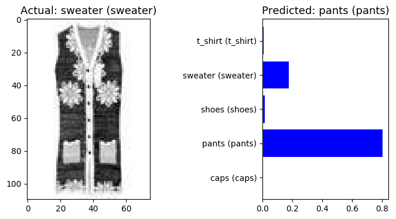
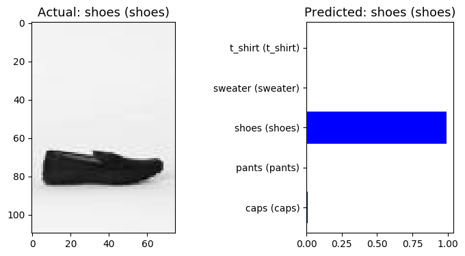

Fashion AI
------------

Training a convolutional network using Keras and Tensorflow to recognize clothing pieces. Inspired by the [following project.](https://github.com/jasminevasandani/know-your-ai)

Getting Started
------------

***Disclaimer***: This is still a work in progress. 

**Following libraries are being used:**
* keras
* tensorflow
* numpy
* pandas
* matplotlib.pygot
* seaborn
* pillow

**Our dataset:**
1. Due to copyright reasons, our dataset is not included in this repository.
2. We use images provided by H&M and Zara to train our model.
3. Has the following properties
    * Caps (62 images)
    * Pants (54 images)
    * Shoes (100 images)
    * Sweater (180 images)
    * T-Shirt (75 images)
4. Since this is a rather small sample to train our network, we use Keras ImageDataGenerator to augment our dataset in "fashion_create_model.py".
    

**The 3 main files:**
1. files_to_CSV.py
    * This file pre-processes our images. It takes our dataset and resizes all files to 75x110 pixels while also converting them to grayscale. Lastly, it uses numpy to save all data into a .csv file.
2. fashion_create_model.py
    * Reads our .csv file and trains our neuronal network. We save the model as "model_fashion_2.h5" using Tensorflow.
3. fashion_test_model.py
    * Loading our created model into this file to test it.

**Output**

- Successful Prediction

    

- Failed Prediction

    

Sources
------------
- [Keras Image PreProcessing](https://keras.io/preprocessing/image/)
- [Keras: Building powerful image classification models using very little data](https://blog.keras.io/building-powerful-image-classification-models-using-very-little-data.html)

